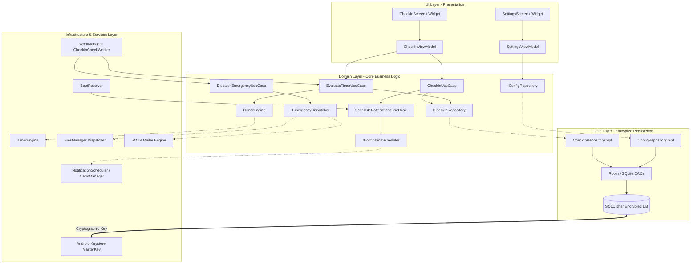
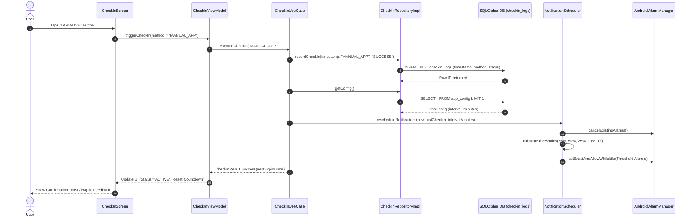
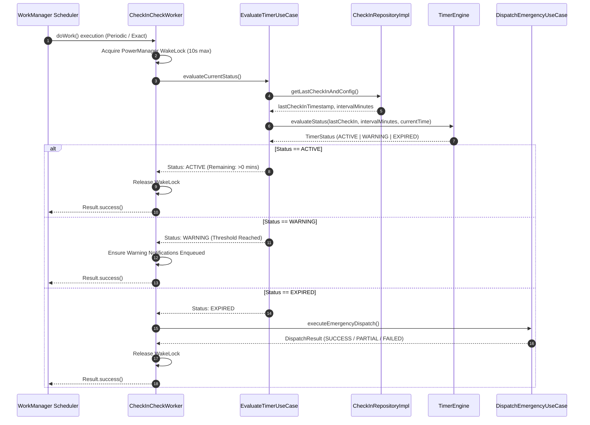
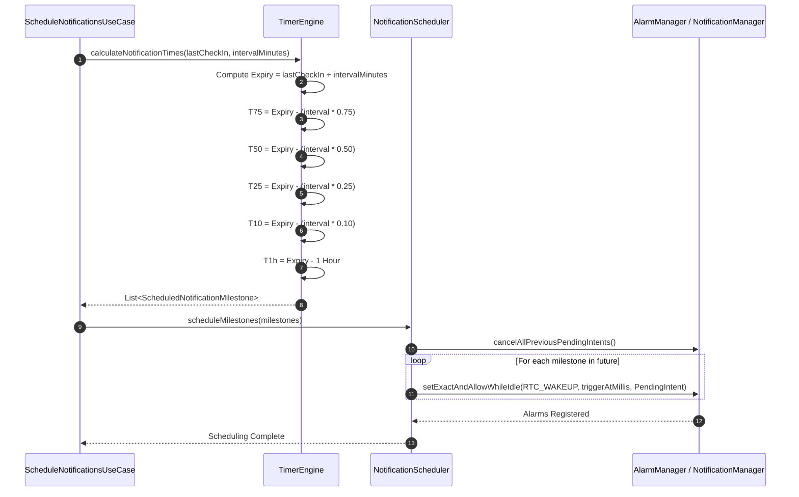
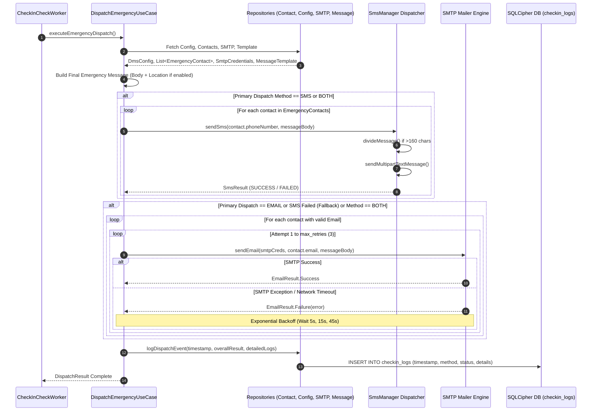

# Dead Man's Switch Mobile Application
## Architecture & Encrypted Database Schema Design Specification

**Document Version:** 1.0.0  
**Target Platform:** Android (Native Kotlin / Flutter with Native Background Services)  
**Security Level:** High (Local SQLCipher AES-256 Encrypted Database + Android Keystore Master Key)  
**Status:** Approved Architectural Specification  

---

## 1. Executive Summary & System Overview

The **Dead Man's Switch (DMS)** mobile application is a high-reliability, zero-trust local safety system. Its primary purpose is to monitor user vitality via periodic manual check-ins ("I am alive" confirmations). If a user fails to check in within a user-configured timer interval, the system autonomously triggers emergency dispatch mechanisms—sending SMS alerts via `SmsManager` and fallback email alerts via SMTP to predefined emergency contacts.

### Key System Principles:
1. **Offline-First & Local Autonomy**: All data, timer calculations, push notifications, and dispatch decisions occur locally on device without dependency on external server backends or internet availability for basic operation (SMS dispatch works over cellular PSTN network without data plan).
2. **Zero-Trust Encrypted Local State**: Database storage uses **SQLCipher (AES-256-CBC)**. Sensitive credentials (such as SMTP passwords) undergo double-envelope encryption using the **Android Keystore System** (`MasterKey` with AES-256 GCM).
3. **Fail-Safe & High Reliability Execution**: Background monitoring relies on Android `WorkManager` (periodic worker) supplemented by exact `AlarmManager` timers and system boot receivers (`RECEIVE_BOOT_COMPLETED`), ensuring timer state survives app termination, device reboots, and Doze mode constraints.

---

## 2. Clean Architecture & MVVM Architectural Design

The application architecture enforces **Clean Architecture** principles combined with the **MVVM (Model-View-ViewModel)** presentation pattern. Dependencies strictly point inward toward the Core Domain layer.

```
       +-------------------------------------------------------------+
       |                        UI LAYER                             |
       |  (Activities, Composable/Widgets, ViewModels, UI State)     |
       +------------------------------+------------------------------+
                                      |
                                      v
       +-------------------------------------------------------------+
       |                      DOMAIN LAYER                           |
       |  (Use Cases, Domain Entities, Repository & Service Interfaces)|
       +------------------------------+------------------------------+
                                      ^
                                      |
       +------------------------------+------------------------------+
       |                 DATA LAYER & SERVICES LAYER                 |
       | (Repositories, DAOs, SQLCipher DB, Services, Background)    |
       +-------------------------------------------------------------+
```

### 2.1 Layer Breakdown

#### A. Presentation Layer (UI & ViewModels)
- **Views**: UI components (Jetpack Compose or Flutter Widgets) rendered on screen. Zero business logic.
  - `CheckInScreen`: Displays countdown timer, check-in button, current status badge (Active/Warning/Expired).
  - `SettingsScreen`: Interval configuration (hours/days), primary dispatch method picker.
  - `EmergencyContactsScreen`: CRUD list for emergency contacts with priority ranking.
  - `SmtpConfigScreen`: Configuration for SMTP host, port, authentication credentials, and TLS toggle.
  - `LogHistoryScreen`: Audit log of user check-ins and emergency dispatch events.
- **ViewModels**: Expose reactive UI state (`StateFlow` / `LiveData` or `ChangeNotifier`). Handle UI user actions and delegate directly to Domain Use Cases.
  - `CheckInViewModel`: Manages check-in triggers, live countdown timer updates, and status state.
  - `SettingsViewModel`: Handles loading/saving config and validating intervals.
  - `ContactViewModel`: Manages contact addition, deletion, and priority ordering.
  - `LogViewModel`: Fetches check-in logs and filter states.

#### B. Domain Layer (Pure Kotlin / Dart Core)
Contains pure business logic, framework-agnostic rules, and interface contracts.
- **Use Cases**:
  - `CheckInUseCase`: Resets timer, records check-in event, reschedules push notifications.
  - `EvaluateTimerUseCase`: Calculates elapsed time since last check-in, determines timer status (`ACTIVE`, `WARNING`, `EXPIRED`).
  - `ScheduleNotificationsUseCase`: Computes countdown warning thresholds (75%, 50%, 25%, 10%, 1h) and schedules local alarms.
  - `DispatchEmergencyUseCase`: Triggers SMS and SMTP email dispatches when timer expires.
  - `ManageContactsUseCase` & `ManageConfigUseCase`: Encapsulates validation and CRUD rules.
- **Domain Models**: Immutable entities (`DmsConfig`, `EmergencyContact`, `SmtpCredentials`, `CheckInLog`, `EmergencyMessage`, `TimerStatus`).
- **Interfaces**:
  - Repositories: `ICheckInRepository`, `IConfigRepository`, `IContactRepository`, `ISmtpRepository`, `ILogRepository`.
  - Services: `ITimerEngine`, `INotificationScheduler`, `IEmergencyDispatcher`, `ISecureStorage`.

#### C. Data Layer (Persistence & Data Mapping)
- **Repositories**: Implements domain repository interfaces (`CheckInRepositoryImpl`, `ConfigRepositoryImpl`, etc.). Transforms database entity models into clean domain models.
- **SQLCipher Encrypted Database (`AppEncryptedDatabase`)**: SQLCipher Room/SQLite database instance initialized using a 256-bit passphrase derived from Android Keystore.
- **Data Access Objects (DAOs)**: `AppConfigDao`, `EmergencyContactsDao`, `SmtpCredentialsDao`, `CheckinLogsDao`, `EmergencyMessagesDao`.
- **Encrypted Storage Wrapper (`SecureStorageService`)**: Manages Android Keystore keys and `EncryptedSharedPreferences` for double-wrapped secret values.

#### D. Infrastructure & Services Layer (OS Integration)
- **`TimerEngine`**: Pure mathematical engine calculating remaining duration, threshold timestamps, and status evaluation.
- **`WorkManagerWorker` (`CheckInCheckWorker`)**: Background periodic worker (15 min execution window) running independently of UI lifecycle. Checks timer expiry and triggers dispatch when needed.
- **`BootReceiver`**: Listens for `ACTION_BOOT_COMPLETED` and `ACTION_LOCKED_BOOT_COMPLETED` to reschedule background workers and alarms after device reboots.
- **`NotificationScheduler`**: Enqueues system alarms via Android `AlarmManager` and manages high-priority Notification Channels.
- **`EmergencyDispatcher`**: Orchestrates SMS dispatch via `SmsManager` and SMTP email delivery with exponential backoff retry logic (up to 3 attempts).

---

### 2.2 System Architecture Diagrams

#### Mermaid System Architecture Diagram


#### ASCII System Architecture Diagram
```
+-----------------------------------------------------------------------------------+
|                                  PRESENTATION LAYER                               |
|  +--------------------+   +--------------------+   +---------------------------+  |
|  |   CheckInScreen    |   |   SettingsScreen   |   | EmergencyContactsScreen   |  |
|  +---------+----------+   +---------+----------+   +-------------+-------------+  |
|            |                        |                            |                |
|            v                        v                            v                |
|  +--------------------+   +--------------------+   +---------------------------+  |
|  |  CheckInViewModel  |   | SettingsViewModel  |   |   ContactViewModel        |  |
|  +---------+----------+   +---------+----------+   +-------------+-------------+  |
+------------|------------------------|----------------------------|----------------+
             |                        |                            |
             v                        v                            v
+-----------------------------------------------------------------------------------+
|                                     DOMAIN LAYER                                  |
|  +------------------+  +--------------------+  +-------------------------------+  |
|  |  CheckInUseCase  |  | EvaluateTimerUC    |  | DispatchEmergencyUseCase      |  |
|  +--------+---------+  +---------+----------+  +---------------+---------------+  |
|           |                      |                         |                      |
|           +----------+-----------+                         |                      |
|                      v                                     v                      |
|  +---------------------------------------+   +---------------------------------+  |
|  | Repository Interfaces                 |   | Service Interfaces              |  |
|  | (ICheckInRepository, IConfigRepository|   | (ITimerEngine, IEmergencyDisp,  |  |
|  |  IContactRepository, ISmtpRepository) |   |  INotificationScheduler)        |  |
|  +-------------------+-------------------+   +----------------+----------------+  |
+----------------------|----------------------------------------|-------------------+
                       |                                        |
                       v                                        v
+-----------------------------------------------------------------------------------+
|                             DATA & INFRASTRUCTURE LAYER                           |
|  +---------------------------------------+   +---------------------------------+  |
|  | Repository Implementations            |   | Engine & OS Implementations     |  |
|  | (CheckInRepositoryImpl, ConfigImpl)   |   | (TimerEngine, SmsManager,       |  |
|  +-------------------+-------------------+   |  SmtpClient, NotificationSched) |  |
|                      |                       +----------------+----------------+  |
|                      v                                        ^                   |
|  +---------------------------------------+                    |                   |
|  | DAOs (Data Access Objects)            |                    |                   |
|  +-------------------+-------------------+                    |                   |
|                      |                                        |                   |
|                      v                                        |                   |
|  +---------------------------------------+   +----------------+----------------+  |
|  | SQLCipher Encrypted SQLite DB         |   | WorkManager & BootReceiver      |  |
|  | (AES-256-CBC Encrypted Database)      |   | (Background Worker Execution)  |  |
|  +-------------------+-------------------+   +---------------------------------+  |
|                      ^                                                            |
|                      | Master Key / Passphrase Encryption                         |
|  +-------------------+-------------------+                                        |
|  | Android Keystore System (MasterKey)   |                                        |
|  +---------------------------------------+                                        |
+-----------------------------------------------------------------------------------+
```

---

## 3. Data Flow Diagrams

### 3.1 Flow 1: User Check-In Flow
Triggered when the user taps the "I AM ALIVE" check-in button in the app UI or notification action.

#### Mermaid Diagram


#### ASCII Art Diagram
```
[User]
  |
  | 1. Taps "I AM ALIVE"
  v
[CheckInScreen] --( 2. triggerCheckIn() )--> [CheckInViewModel]
                                                    |
                                                    | 3. executeCheckIn()
                                                    v
                                            [CheckInUseCase]
                                            /              \
         4. recordCheckIn()                /                \ 6. rescheduleNotifications()
        v                                 /                  v
[CheckInRepositoryImpl]                  /         [NotificationScheduler]
        |                               /                    |
        | 5. INSERT INTO checkin_logs  /                     | 7. cancelExistingAlarms()
        v                             /                      | 8. calculateThresholds()
[SQLCipher DB] <---------------------+                       | 9. setExactAndAllowWhileIdle()
 (checkin_logs)                                              v
                                                   [Android AlarmManager]
```

---

### 3.2 Flow 2: Background Timer Monitoring Flow
Executed periodically by Android `WorkManager` (every 15 minutes) or upon exact alarm wakeups to verify timer validity.

#### Mermaid Diagram


#### ASCII Art Diagram
```
[WorkManager Periodic Trigger]
              |
              | 1. doWork()
              v
    [CheckInCheckWorker] --(Acquires WakeLock)
              |
              | 2. evaluateCurrentStatus()
              v
   [EvaluateTimerUseCase]
      /              \
     / 3. Query DB    \ 4. calculateRemainingTime()
    v                  v
[CheckInRepository]  [TimerEngine]
    |                  |
    +--------+---------+
             |
             | 5. Return TimerStatus (ACTIVE / WARNING / EXPIRED)
             v
   [EvaluateTimerUseCase]
             |
     +-------+-----------------------+-----------------------+
     |                               |                       |
     | Status == ACTIVE              | Status == WARNING     | Status == EXPIRED
     v                               v                       v
[Log & Return Success]    [Verify Notifications]   [DispatchEmergencyUseCase]
```

---

### 3.3 Flow 3: Local Push Notification Scheduling Flow
Calculates notification countdown warning milestones and schedules exact local alarms via Android `AlarmManager`.

#### Milestone Intervals:
- Milestone 1: **75% Remaining Time** (e.g. 18h remaining on 24h timer)
- Milestone 2: **50% Remaining Time** (e.g. 12h remaining on 24h timer)
- Milestone 3: **25% Remaining Time** (e.g. 6h remaining on 24h timer)
- Milestone 4: **10% Remaining Time** (e.g. 2.4h remaining on 24h timer)
- Milestone 5: **1 Hour Remaining Time** (Final Urgent Alert)

#### Mermaid Diagram


#### ASCII Art Diagram
```
[ScheduleNotificationsUseCase]
              |
              | 1. calculateNotificationTimes(lastCheckIn, interval)
              v
        [TimerEngine]
              |
              +--> ExpiryTime = lastCheckIn + interval
              +--> T_75 = Expiry - (interval * 0.75)
              +--> T_50 = Expiry - (interval * 0.50)
              +--> T_25 = Expiry - (interval * 0.25)
              +--> T_10 = Expiry - (interval * 0.10)
              +--> T_1h = Expiry - 1 hour
              |
              | 2. Return List<Milestone>
              v
[NotificationScheduler]
              |
              | 3. cancelPreviousAlarms()
              | 4. Loop over future milestones
              v
[Android AlarmManager] ---> [System Notification Manager]
 (PendingIntents Set)        (Triggers High Priority Local Push Alerts)
```

---

### 3.4 Flow 4: Autonomous Emergency Dispatch Flow
Triggered automatically when the countdown timer expires without a user check-in.

#### Primary Method: SMS via `SmsManager`
#### Fallback Method: SMTP Email with Exponential Backoff Retry (Up to 3 Attempts)

#### Mermaid Diagram


#### ASCII Art Diagram
```
[CheckInCheckWorker]
         |
         | 1. executeEmergencyDispatch()
         v
[DispatchEmergencyUseCase]
         |
         | 2. Fetch Config, Contacts, SMTP Creds & Message Body Template
         v
  [SQLCipher DB]
         |
         v
[DispatchEmergencyUseCase] -- 3. Build Final Emergency Text
         |
         +---------------------------------------+
         |                                       |
         v                                       v
[Primary: SmsManager Dispatcher]        [Secondary/Fallback: SMTP Mailer Engine]
         |                                       |
         | 4. sendMultipartTextMessage()         | 5. Attempt 1: sendEmail()
         v                                       |    +--> If failed: Wait 5s -> Attempt 2
  (Cellular Network)                             |    +--> If failed: Wait 15s -> Attempt 3
         |                                       v
         | SMS Result                       (Internet Network)
         +-------------------+-------------------+
                             |
                             v 6. Log Audit Result
                    [CheckInRepository]
                             |
                             v 7. INSERT INTO checkin_logs
                      [SQLCipher DB]
```

---

## 4. Encrypted Database Schema & Security Architecture

### 4.1 Encryption Architecture & Master Key Management

To guarantee data confidentiality even if the device is lost, rooted, or physically compromised, the application employs a two-tier encryption design:

1. **Database-Level Encryption (SQLCipher AES-256-CBC)**:
   - The SQLite database file is encrypted using SQLCipher.
   - A 256-bit (32-byte) random passphrase is generated on first boot using `SecureRandom`.
   - This database passphrase is stored securely in `EncryptedSharedPreferences` backed by the **Android Keystore System**.
   - Before opening the database, `SQLiteDatabase.loadLibs(context)` is called, and the passphrase is supplied via `SupportFactory(passphrase)`.

2. **Field-Level Envelope Encryption (Android Keystore MasterKey)**:
   - Extremely sensitive text fields (such as `smtp_credentials.password_encrypted`) undergo double-envelope AES-256 GCM encryption.
   - Key Alias: `"dms_master_key"`
   - `KeyGenParameterSpec` Configuration:
     ```kotlin
     MasterKey.Builder(context)
         .setKeyScheme(MasterKey.KeyScheme.AES256_GCM)
         .setRequestUnlockedDeviceRequired(false)
         .build()
     ```
   - Cipher algorithm: `AES/GCM/NoPadding` with a 12-byte random Initialization Vector (IV). The cipher text is stored as a Base64 string containing `[IV (12 bytes) + Ciphertext + Auth Tag (16 bytes)]`.

---

### 4.2 SQL DDL Schema Statements

```sql
-- Enable Foreign Key constraints in SQLite / SQLCipher
PRAGMA foreign_keys = ON;

-- -----------------------------------------------------------------------------
-- 1. Table: app_config
-- Holds single-row global application timer intervals and dispatch preferences.
-- -----------------------------------------------------------------------------
CREATE TABLE IF NOT EXISTS app_config (
    id INTEGER PRIMARY KEY CHECK (id = 1),
    timer_interval_minutes INTEGER NOT NULL DEFAULT 1440,
    primary_dispatch_method TEXT NOT NULL DEFAULT 'SMS' 
        CHECK (primary_dispatch_method IN ('SMS', 'EMAIL', 'BOTH', 'SMS_THEN_EMAIL')),
    retry_count INTEGER NOT NULL DEFAULT 3 
        CHECK (retry_count BETWEEN 1 AND 10),
    is_active INTEGER NOT NULL DEFAULT 1 
        CHECK (is_active IN (0, 1)),
    created_at TEXT NOT NULL DEFAULT (datetime('now')),
    updated_at TEXT NOT NULL DEFAULT (datetime('now'))
);

-- -----------------------------------------------------------------------------
-- 2. Table: emergency_contacts
-- Holds recipient emergency contact information ranked by priority.
-- -----------------------------------------------------------------------------
CREATE TABLE IF NOT EXISTS emergency_contacts (
    id INTEGER PRIMARY KEY AUTOINCREMENT,
    recipient_name TEXT NOT NULL,
    phone_number TEXT NOT NULL,
    email_address TEXT NOT NULL,
    priority INTEGER NOT NULL DEFAULT 1,
    is_enabled INTEGER NOT NULL DEFAULT 1 
        CHECK (is_enabled IN (0, 1)),
    created_at TEXT NOT NULL DEFAULT (datetime('now'))
);

CREATE INDEX IF NOT EXISTS idx_contacts_priority ON emergency_contacts(priority ASC);

-- -----------------------------------------------------------------------------
-- 3. Table: smtp_credentials
-- Holds single-row outbound SMTP server configuration and encrypted password.
-- -----------------------------------------------------------------------------
CREATE TABLE IF NOT EXISTS smtp_credentials (
    id INTEGER PRIMARY KEY CHECK (id = 1),
    host TEXT NOT NULL,
    port INTEGER NOT NULL DEFAULT 587 
        CHECK (port BETWEEN 1 AND 65535),
    username TEXT NOT NULL,
    password_encrypted TEXT NOT NULL,
    enable_tls INTEGER NOT NULL DEFAULT 1 
        CHECK (enable_tls IN (0, 1)),
    updated_at TEXT NOT NULL DEFAULT (datetime('now'))
);

-- -----------------------------------------------------------------------------
-- 4. Table: checkin_logs
-- Audit log recording manual check-ins, system warnings, and emergency dispatches.
-- -----------------------------------------------------------------------------
CREATE TABLE IF NOT EXISTS checkin_logs (
    id INTEGER PRIMARY KEY AUTOINCREMENT,
    timestamp TEXT NOT NULL DEFAULT (datetime('now')),
    method TEXT NOT NULL 
        CHECK (method IN ('MANUAL_APP', 'NOTIFICATION_ACTION', 'WIDGET', 'SYSTEM_AUTO')),
    status TEXT NOT NULL 
        CHECK (status IN ('SUCCESS', 'WARNING_ISSUED', 'EXPIRED', 'DISPATCH_TRIGGERED', 'DISPATCH_FAILED')),
    details TEXT
);

CREATE INDEX IF NOT EXISTS idx_checkin_logs_timestamp ON checkin_logs(timestamp DESC);

-- -----------------------------------------------------------------------------
-- 5. Table: emergency_messages
-- Holds single-row emergency body template sent during dispatch.
-- -----------------------------------------------------------------------------
CREATE TABLE IF NOT EXISTS emergency_messages (
    id INTEGER PRIMARY KEY CHECK (id = 1),
    body_template TEXT NOT NULL,
    contains_location INTEGER NOT NULL DEFAULT 0 
        CHECK (contains_location IN (0, 1)),
    last_updated TEXT NOT NULL DEFAULT (datetime('now'))
);
```

---

### 4.3 Detailed Table Schema Documentation

#### 1. Table `app_config`
Enforces a single-row constraint (`id = 1`). Storing system-wide configuration settings.

| Column Name | Data Type | Constraints | Default | Purpose / Description |
|-------------|-----------|-------------|---------|-----------------------|
| `id` | `INTEGER` | `PRIMARY KEY`, `CHECK (id = 1)` | `1` | Single-row singleton enforcement key. |
| `timer_interval_minutes` | `INTEGER` | `NOT NULL` | `1440` | Check-in countdown window in minutes (e.g. 1440 = 24 hours). |
| `primary_dispatch_method` | `TEXT` | `NOT NULL`, `CHECK` | `'SMS'` | Primary dispatch channel: `'SMS'`, `'EMAIL'`, `'BOTH'`, `'SMS_THEN_EMAIL'`. |
| `retry_count` | `INTEGER` | `NOT NULL`, `CHECK (1..10)` | `3` | Maximum retry attempts for failed SMTP email dispatches. |
| `is_active` | `INTEGER` | `NOT NULL`, `CHECK (0,1)` | `1` | Master safety switch toggle (1 = switch active, 0 = paused). |
| `created_at` | `TEXT` | `NOT NULL` | `datetime('now')` | ISO-8601 creation timestamp. |
| `updated_at` | `TEXT` | `NOT NULL` | `datetime('now')` | ISO-8601 last modified timestamp. |

#### 2. Table `emergency_contacts`
Contains the list of trusted recipients who will receive emergency dispatches upon timer expiry.

| Column Name | Data Type | Constraints | Default | Purpose / Description |
|-------------|-----------|-------------|---------|-----------------------|
| `id` | `INTEGER` | `PRIMARY KEY AUTOINCREMENT` | Auto | Unique contact identifier. |
| `recipient_name` | `TEXT` | `NOT NULL` | - | Contact full name (e.g. "Jane Doe"). |
| `phone_number` | `TEXT` | `NOT NULL` | - | E.164 formatted phone number for SMS dispatch. |
| `email_address` | `TEXT` | `NOT NULL` | - | Email address for SMTP dispatch. |
| `priority` | `INTEGER` | `NOT NULL` | `1` | Order of dispatch precedence (1 = highest priority). |
| `is_enabled` | `INTEGER` | `NOT NULL`, `CHECK (0,1)` | `1` | Active flag for recipient contact (1 = enabled, 0 = disabled). |
| `created_at` | `TEXT` | `NOT NULL` | `datetime('now')` | ISO-8601 creation timestamp. |

#### 3. Table `smtp_credentials`
Enforces a single-row constraint (`id = 1`). Contains mail server configuration.

| Column Name | Data Type | Constraints | Default | Purpose / Description |
|-------------|-----------|-------------|---------|-----------------------|
| `id` | `INTEGER` | `PRIMARY KEY`, `CHECK (id = 1)` | `1` | Single-row singleton enforcement key. |
| `host` | `TEXT` | `NOT NULL` | - | SMTP server hostname (e.g. `smtp.gmail.com`). |
| `port` | `INTEGER` | `NOT NULL`, `CHECK (1..65535)`| `587` | SMTP port (e.g. 587 for STARTTLS, 465 for SSL). |
| `username` | `TEXT` | `NOT NULL` | - | SMTP authentication username / sender email. |
| `password_encrypted` | `TEXT` | `NOT NULL` | - | AES-256-GCM envelope encrypted password (Base64). |
| `enable_tls` | `INTEGER` | `NOT NULL`, `CHECK (0,1)` | `1` | Flag to mandate STARTTLS / TLS encryption. |
| `updated_at` | `TEXT` | `NOT NULL` | `datetime('now')` | ISO-8601 last update timestamp. |

#### 4. Table `checkin_logs`
Historical audit trail of all check-in activities, countdown resets, and emergency dispatches.

| Column Name | Data Type | Constraints | Default | Purpose / Description |
|-------------|-----------|-------------|---------|-----------------------|
| `id` | `INTEGER` | `PRIMARY KEY AUTOINCREMENT` | Auto | Unique log record identifier. |
| `timestamp` | `TEXT` | `NOT NULL` | `datetime('now')` | ISO-8601 timestamp of log event. |
| `method` | `TEXT` | `NOT NULL`, `CHECK` | - | Origin: `'MANUAL_APP'`, `'NOTIFICATION_ACTION'`, `'WIDGET'`, `'SYSTEM_AUTO'`. |
| `status` | `TEXT` | `NOT NULL`, `CHECK` | - | Event outcome: `'SUCCESS'`, `'WARNING_ISSUED'`, `'EXPIRED'`, `'DISPATCH_TRIGGERED'`, `'DISPATCH_FAILED'`. |
| `details` | `TEXT` | `NULLABLE` | NULL | Optional diagnostic information or error stack traces. |

#### 5. Table `emergency_messages`
Enforces single-row constraint (`id = 1`). Message template dispatched to emergency contacts.

| Column Name | Data Type | Constraints | Default | Purpose / Description |
|-------------|-----------|-------------|---------|-----------------------|
| `id` | `INTEGER` | `PRIMARY KEY`, `CHECK (id = 1)` | `1` | Single-row singleton enforcement key. |
| `body_template` | `TEXT` | `NOT NULL` | - | Alert message body text template. |
| `contains_location` | `INTEGER` | `NOT NULL`, `CHECK (0,1)` | `0` | Boolean flag indicating whether GPS coordinates should be appended. |
| `last_updated` | `TEXT` | `NOT NULL` | `datetime('now')` | ISO-8601 last update timestamp. |

---

## 5. Data Models Implementation

### 5.1 Kotlin Data Models (Android Native / Room Support)

```kotlin
package com.dms.app.data.models

import androidx.room.ColumnInfo
import androidx.room.Entity
import androidx.room.PrimaryKey
import java.time.Instant

/**
 * 1. AppConfig Entity
 */
@Entity(tableName = "app_config")
data class AppConfigEntity(
    @PrimaryKey
    @ColumnInfo(name = "id")
    val id: Int = 1,

    @ColumnInfo(name = "timer_interval_minutes")
    val timerIntervalMinutes: Int = 1440,

    @ColumnInfo(name = "primary_dispatch_method")
    val primaryDispatchMethod: String = "SMS",

    @ColumnInfo(name = "retry_count")
    val retryCount: Int = 3,

    @ColumnInfo(name = "is_active")
    val isActive: Boolean = true,

    @ColumnInfo(name = "created_at")
    val createdAt: String = Instant.now().toString(),

    @ColumnInfo(name = "updated_at")
    val updatedAt: String = Instant.now().toString()
)

/**
 * 2. EmergencyContact Entity
 */
@Entity(tableName = "emergency_contacts")
data class EmergencyContactEntity(
    @PrimaryKey(autoGenerate = true)
    @ColumnInfo(name = "id")
    val id: Long = 0,

    @ColumnInfo(name = "recipient_name")
    val recipientName: String,

    @ColumnInfo(name = "phone_number")
    val phoneNumber: String,

    @ColumnInfo(name = "email_address")
    val emailAddress: String,

    @ColumnInfo(name = "priority")
    val priority: Int = 1,

    @ColumnInfo(name = "is_enabled")
    val isEnabled: Boolean = true,

    @ColumnInfo(name = "created_at")
    val createdAt: String = Instant.now().toString()
)

/**
 * 3. SmtpCredentials Entity
 */
@Entity(tableName = "smtp_credentials")
data class SmtpCredentialsEntity(
    @PrimaryKey
    @ColumnInfo(name = "id")
    val id: Int = 1,

    @ColumnInfo(name = "host")
    val host: String,

    @ColumnInfo(name = "port")
    val port: Int = 587,

    @ColumnInfo(name = "username")
    val username: String,

    @ColumnInfo(name = "password_encrypted")
    val passwordEncrypted: String,

    @ColumnInfo(name = "enable_tls")
    val enableTls: Boolean = true,

    @ColumnInfo(name = "updated_at")
    val updatedAt: String = Instant.now().toString()
)

/**
 * 4. CheckInLog Entity
 */
@Entity(tableName = "checkin_logs")
data class CheckInLogEntity(
    @PrimaryKey(autoGenerate = true)
    @ColumnInfo(name = "id")
    val id: Long = 0,

    @ColumnInfo(name = "timestamp")
    val timestamp: String = Instant.now().toString(),

    @ColumnInfo(name = "method")
    val method: String,

    @ColumnInfo(name = "status")
    val status: String,

    @ColumnInfo(name = "details")
    val details: String? = null
)

/**
 * 5. EmergencyMessage Entity
 */
@Entity(tableName = "emergency_messages")
data class EmergencyMessageEntity(
    @PrimaryKey
    @ColumnInfo(name = "id")
    val id: Int = 1,

    @ColumnInfo(name = "body_template")
    val bodyTemplate: String,

    @ColumnInfo(name = "contains_location")
    val containsLocation: Boolean = false,

    @ColumnInfo(name = "last_updated")
    val lastUpdated: String = Instant.now().toString()
)
```

---

### 5.2 Dart Data Models (Flutter / sqflite_sqlcipher Support)

```dart
import 'dart:convert';

/// 1. AppConfig Model
class AppConfig {
  final int id;
  final int timerIntervalMinutes;
  final String primaryDispatchMethod;
  final int retryCount;
  final bool isActive;
  final String createdAt;
  final String updatedAt;

  const AppConfig({
    this.id = 1,
    this.timerIntervalMinutes = 1440,
    this.primaryDispatchMethod = 'SMS',
    this.retryCount = 3,
    this.isActive = true,
    required this.createdAt,
    required this.updatedAt,
  });

  Map<String, dynamic> toMap() {
    return {
      'id': id,
      'timer_interval_minutes': timerIntervalMinutes,
      'primary_dispatch_method': primaryDispatchMethod,
      'retry_count': retryCount,
      'is_active': isActive ? 1 : 0,
      'created_at': createdAt,
      'updated_at': updatedAt,
    };
  }

  factory AppConfig.fromMap(Map<String, dynamic> map) {
    return AppConfig(
      id: map['id'] as int,
      timerIntervalMinutes: map['timer_interval_minutes'] as int,
      primaryDispatchMethod: map['primary_dispatch_method'] as String,
      retryCount: map['retry_count'] as int,
      isActive: (map['is_active'] as int) == 1,
      createdAt: map['created_at'] as String,
      updatedAt: map['updated_at'] as String,
    );
  }
}

/// 2. EmergencyContact Model
class EmergencyContact {
  final int? id;
  final String recipientName;
  final String phoneNumber;
  final String emailAddress;
  final int priority;
  final bool isEnabled;
  final String createdAt;

  const EmergencyContact({
    this.id,
    required this.recipientName,
    required this.phoneNumber,
    required this.emailAddress,
    this.priority = 1,
    this.isEnabled = true,
    required this.createdAt,
  });

  Map<String, dynamic> toMap() {
    return {
      if (id != null) 'id': id,
      'recipient_name': recipientName,
      'phone_number': phoneNumber,
      'email_address': emailAddress,
      'priority': priority,
      'is_enabled': isEnabled ? 1 : 0,
      'created_at': createdAt,
    };
  }

  factory EmergencyContact.fromMap(Map<String, dynamic> map) {
    return EmergencyContact(
      id: map['id'] as int?,
      recipientName: map['recipient_name'] as String,
      phoneNumber: map['phone_number'] as String,
      emailAddress: map['email_address'] as String,
      priority: map['priority'] as int,
      isEnabled: (map['is_enabled'] as int) == 1,
      createdAt: map['created_at'] as String,
    );
  }
}

/// 3. SmtpCredentials Model
class SmtpCredentials {
  final int id;
  final String host;
  final int port;
  final String username;
  final String passwordEncrypted;
  final bool enableTls;
  final String updatedAt;

  const SmtpCredentials({
    this.id = 1,
    required this.host,
    this.port = 587,
    required this.username,
    required this.passwordEncrypted,
    this.enableTls = true,
    required this.updatedAt,
  });

  Map<String, dynamic> toMap() {
    return {
      'id': id,
      'host': host,
      'port': port,
      'username': username,
      'password_encrypted': passwordEncrypted,
      'enable_tls': enableTls ? 1 : 0,
      'updated_at': updatedAt,
    };
  }

  factory SmtpCredentials.fromMap(Map<String, dynamic> map) {
    return SmtpCredentials(
      id: map['id'] as int,
      host: map['host'] as String,
      port: map['port'] as int,
      username: map['username'] as String,
      passwordEncrypted: map['password_encrypted'] as String,
      enableTls: (map['enable_tls'] as int) == 1,
      updatedAt: map['updated_at'] as String,
    );
  }
}

/// 4. CheckInLog Model
class CheckInLog {
  final int? id;
  final String timestamp;
  final String method;
  final String status;
  final String? details;

  const CheckInLog({
    this.id,
    required this.timestamp,
    required this.method,
    required this.status,
    this.details,
  });

  Map<String, dynamic> toMap() {
    return {
      if (id != null) 'id': id,
      'timestamp': timestamp,
      'method': method,
      'status': status,
      'details': details,
    };
  }

  factory CheckInLog.fromMap(Map<String, dynamic> map) {
    return CheckInLog(
      id: map['id'] as int?,
      timestamp: map['timestamp'] as String,
      method: map['method'] as String,
      status: map['status'] as String,
      details: map['details'] as String?,
    );
  }
}

/// 5. EmergencyMessage Model
class EmergencyMessage {
  final int id;
  final String bodyTemplate;
  final bool containsLocation;
  final String lastUpdated;

  const EmergencyMessage({
    this.id = 1,
    required this.bodyTemplate,
    this.containsLocation = false,
    required this.lastUpdated,
  });

  Map<String, dynamic> toMap() {
    return {
      'id': id,
      'body_template': bodyTemplate,
      'contains_location': containsLocation ? 1 : 0,
      'last_updated': lastUpdated,
    };
  }

  factory EmergencyMessage.fromMap(Map<String, dynamic> map) {
    return EmergencyMessage(
      id: map['id'] as int,
      bodyTemplate: map['body_template'] as String,
      containsLocation: (map['contains_location'] as int) == 1,
      lastUpdated: map['last_updated'] as String,
    );
  }
}
```

---

## 6. Technical Verification & Integrity Matrix

| Component | Verification Method | Expected Outcome |
|-----------|---------------------|------------------|
| **Architecture Layout** | Code Structure Inspection | Clean Architecture principles maintained. No Data layer dependencies in Presentation/Domain. |
| **SQLCipher Encryption** | Pragmas & DB Header Inspection | Opening DB file with plain SQLite driver fails (`file is not a database`). Requires PRAGMA key. |
| **Keystore Key Management** | Android KeyStore Unit Test | Passwords encrypted via MasterKey generate unique 12-byte IV ciphertext blobs that decrypt correctly. |
| **Timer Milestone Calculation** | Pure Kotlin/Dart Unit Tests | Given 24h interval, notification triggers match 18h (75%), 12h (50%), 6h (25%), 2.4h (10%), and 1h exactly. |
| **Dispatch Retry Engine** | Mock Server Integration Test | Simulated SMTP connection timeout causes 3 retry attempts with exponential backoff (5s, 15s, 45s). |

---
*End of Architectural Specification.*
